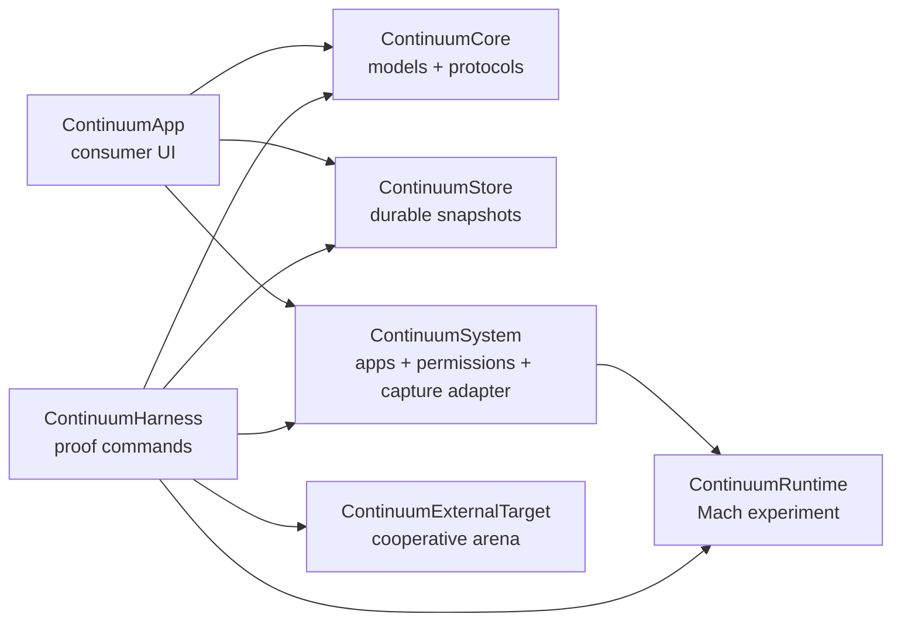

# Continuum architecture

Continuum v0.3 is a native macOS per-app rewind research prototype. The current proof has complete private/COW memory cuts, ARM64 register restoration, mandatory safety snapshots, batched in-place page restoration, APFS file preimages, durable branch transactions, and consumer UI. It is intentionally not described as a universal process-restoration engine.

## Module boundaries

| Module | Owns | Must not own |
| --- | --- | --- |
| `ContinuumCore` | Sendable domain models, identifiers, errors, display naming, and protocols | AppKit, persistence, Mach calls, permission prompts, or presentation state |
| `ContinuumStore` | Durable index, content-addressed chunks, APFS per-file COW roots, in-place file-byte restoration, integrity checks, and atomic snapshot/rewind transactions | File discovery/attribution, process inspection, UI, permission prompts, or claims that unvalidated bytes are restorable |
| `ContinuumRuntime` | Mach task identity, nested VM-map capture, retained COW views, ARM64 register cuts, safety snapshots, batched page restore/readback, and fail-closed topology validation | Descriptor/IPC/GPU restoration, product policy, user consent, arbitrary-app compatibility claims, or durable storage |
| `ContinuumSystem` | Window-owner/app inventory, code-signing inspection, permission requests/status, generic managed-copy setup/recovery, compatibility probing, and global hotkeys | Snapshot indexing, branch policy, SwiftUI state, source-app mutation, or bypassing SIP/TCC |
| `ContinuumApp` | SwiftUI/AppKit consumer shell, onboarding, Snapshot Library, timeline/branch presentation, explicit user actions, and the honest metadata-only checkpoint fallback | Raw store file mutation, Mach implementation details, or silently requesting broad permissions |
| `ContinuumHarness` | Reproducible command-line proofs for setup, VM-region inspection, the owned/external registered-arena experiments, and store transactions | Shipping UI behavior or compatibility certification |
| `ContinuumExternalTarget` | Cooperative signed proof process with one page-aligned arena and a tiny validation protocol | General app behavior, production instrumentation, or a compatibility shortcut |

Dependencies flow inward: `ContinuumApp` and `ContinuumHarness` compose protocols from `ContinuumCore`; concrete store and system modules implement them. `ContinuumCore` stays independent so transaction behavior can be tested without macOS UI or process privileges.

## Runtime composition

The UI talks to protocol-shaped coordinators and never infers restoration from a screenshot or successful metadata write. A snapshot's `RestoreAvailability` is the only user-facing restoration gate. `Unavailable` means inspectable but not playable.

## Snapshot transaction invariants

These invariants apply even while the runtime remains experimental:

1. **Manual snapshots are immutable roots.** Renaming and notes may change metadata; their checkpoint identity and referenced chunks do not change.
2. **A restore never destroys the state being left.** `beginRewind` must durably save a safety snapshot before preview or restore can advance.
3. **Commit is atomic.** `commitRewind` promotes the safety snapshot, preserves the abandoned future as a branch, changes the active branch, and removes the provisional record in one index transaction—or changes none of them.
4. **Cancel is non-destructive.** `cancelRewind` removes only its provisional transaction after the original live state is retained or revalidated.
5. **One transaction mutates a session at a time.** Competing snapshot, commit, cancel, delete, and restore requests are serialized.
6. **Content is addressed by digest.** A committed chunk's bytes must match its recorded digest; duplicate content reuses one physical object.
7. **References outlive branches.** Deleting a snapshot or branch may reclaim only chunks with no remaining snapshot reference.
8. **Index publication comes last.** Chunk files are fully written and made durable before an index can reference them. Readers either observe the old complete state or the new complete state.
9. **Availability is evidence-based.** Only a capture adapter that can validate restoration may publish `Instant` or `Replay required`. Metadata-only checkpoints remain `Unavailable`.
10. **External effects remain external.** A local restore cannot unsend a message, reverse a purchase, or change a remote server. Crossing recorded effects produces a warning, never a success claim.
11. **Storage pressure fails closed.** If permanent safety data cannot fit, rewind does not start. Pinned manual and pre-rewind snapshots are not silently evicted.
12. **Unknown state is not fabricated.** Missing process, descriptor, graphics, helper, or IPC state makes the snapshot unavailable; visual continuity is never presented as functional restoration.
13. **Scope is per app.** A capture group contains one app, its helper/process tree, and certified dependent local writers. Continuum never describes this as a whole-device snapshot.
14. **Files branch with memory by default.** Exact restore uses the captured APFS file root. Keeping newer files with older memory is a separate policy that is disabled unless compatibility validation proves it safe.
15. **Open vnode identity survives.** Hot file restore writes captured bytes into the existing inode. Replacing a path or swapping a clone underneath an open descriptor is not accepted as exact restoration.

The state machine is deliberately small:

```mermaid
stateDiagram-v2
    [*] --> Live
    Live --> Provisional: beginRewind(safety capture committed)
    Provisional --> Live: cancelRewind
    Provisional --> Restoring: commitRewind(target)
    Restoring --> BranchedLive: validated restore
    Restoring --> Live: restore failed; return to safety state
    BranchedLive --> Provisional: rewind or undo again
```

## Storage layout and trust boundary

The store owns an index plus content-addressed chunk files. Index replacement uses a temporary file followed by an atomic rename. Chunk creation precedes index publication; garbage collection follows reference removal. Store keys belong in Keychain, not in the snapshot directory.

Snapshot material should be treated like an unlocked session of the captured application. It may include document text, credentials in memory, file paths, window titles, or personal screen content. The consumer UI must state the selected scope and destination before capture, keep data local by default, and make destructive deletion explicit.

The future scheduler defaults to 100 ms active epochs, conditionally tightens to 50 ms for games only when performance gates pass, and backs off to one second while idle. Its default budgets are 2 GB for 90 seconds of hot history and 20 GB for a 30-minute rolling disk window. A first restorable baseline may cost hundreds of megabytes to multiple gigabytes; later points reference content-addressed deltas. Product surfaces must report logical/shared and physically unique bytes separately. None of these cadence or retention targets are active in the current metadata-only app capturer.

The application does not silently change SIP, edit the selected vendor source, or grant itself TCC permissions. Its opt-in setup coordinator clones a verified `Original.app` and a separate `Managed.app` into Application Support. On this development Mac, SIP is user-disabled for research against unmodified tasks; a consumer build still needs a supported authorization/instrumentation route and Apple-granted system-extension entitlements.

## Research boundary

The runtime now has three proof levels:

1. The self-process proof checkpoints memory allocated by the harness.
2. The registered-arena external proof alternates two target-owned states with readback validation for at least 100 cycles.
3. The full-process proof walks the target's nested VM map, retains COW views for every readable+writable private/COW mapping, captures general/NEON registers, creates a current-state safety cut before restore, compares local views, coalesces changed pages into large writes, restores registers, and validates the result. Current measurements are roughly 50 ms per snapshot and 65–70 ms per hot restore for about 313 MB of logical writable state.

The proof calls `thread_set_state`, but it requires the same task, thread identities, and VM topology. A second functional cycle correctly fails after the target replaces a private allocator mapping with `SM_TRUESHARED` state. Therefore it still does not prove restoration of an arbitrary GUI process. A general native-app rewind engine must separately solve or reject:

- authenticated access to another app's task and complete helper tree;
- safe thread cuts and in-flight syscalls;
- Mach ports, XPC, sockets, file descriptors, locks, and kernel state;
- WindowServer, Core Animation, Metal, audio, input, and device state;
- code signing, library validation, TCC identity, App Store/DRM constraints, and app updates;
- deterministic replay without duplicating external effects.

## Per-app local file transaction

`APFSLocalFileCheckpointStore` is the first real disk primitive:

1. Discovery supplies regular files attributed to one capture group.
2. Capture creates APFS `clonefile` preimages in a private snapshot root and atomically publishes a manifest only after every clone exists.
3. The manifest pins original path, device, inode, byte length, and mode.
4. Restore refuses a changed device/inode, truncates the existing vnode to the historical length, copies bytes from the clone through `pwrite`, and fsyncs before success.
5. A higher coordinator must create the mandatory current-state file root before calling restore.

This layer intentionally does not yet discover files or restore renames, deletes, hard links, xattrs, SQLite locks, pipes, sockets, or shared-daemon writes. Endpoint Security plus an in-process dirty-range journal is the planned attribution/namespace layer. APFS whole-volume revert is not the hot path because it applies on a later mount and would rewind unrelated apps.

Each application is therefore certified from measured capture and restore behavior. A successful managed-copy transaction certifies only that setup is reversible and attachable—not that the app can rewind. Unsupported software remains visible in inventory with an explanation, but no enabled **Play from Here** action. KSP is an eventual acceptance workload for the general engine, not a special-case claim.
