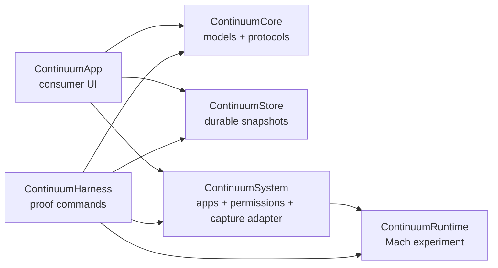

# Continuum architecture

Continuum v0.1 is a native macOS research prototype for the parts of rewind that can be made concrete today: app discovery, permission onboarding, checkpoint experiments, durable snapshot metadata, and branch-safe rewind transactions. It is intentionally not described as a universal process-restoration engine.

## Module boundaries

| Module | Owns | Must not own |
| --- | --- | --- |
| `ContinuumCore` | Sendable domain models, identifiers, errors, display naming, and protocols | AppKit, persistence, Mach calls, permission prompts, or presentation state |
| `ContinuumStore` | Durable index, content-addressed chunks, integrity checks, reference accounting, and atomic snapshot/rewind transactions | Process inspection, UI, permission prompts, or claims that stored bytes are restorable |
| `ContinuumRuntime` | Low-level, self-contained Mach/VM checkpoint experiments and C-compatible runtime primitives | Product policy, user consent, arbitrary-app compatibility claims, or durable storage |
| `ContinuumSystem` | Running-app inventory, code-signing inspection, permission status, compatibility probing, and global hotkey registration | Snapshot indexing, branch policy, SwiftUI state, or bypassing SIP/TCC |
| `ContinuumApp` | SwiftUI/AppKit consumer shell, onboarding, Snapshot Library, timeline/branch presentation, explicit user actions, and the honest metadata-only checkpoint fallback | Raw store file mutation, Mach implementation details, or silently requesting broad permissions |
| `ContinuumHarness` | Reproducible command-line proofs for VM-region inspection, the owned-memory checkpoint experiment, and store transactions | Shipping UI behavior or compatibility certification |

Dependencies flow inward: `ContinuumApp` and `ContinuumHarness` compose protocols from `ContinuumCore`; concrete store and system modules implement them. `ContinuumCore` stays independent so transaction behavior can be tested without macOS UI or process privileges.

## Runtime composition

The UI talks to protocol-shaped coordinators and never infers restoration from a screenshot or successful metadata write. A snapshot's `RestoreAvailability` is the only user-facing restoration gate. `Unavailable` means inspectable but not playable.

## Snapshot transaction invariants

These invariants apply even while the runtime remains experimental:

1. **Manual snapshots are immutable roots.** Renaming and notes may change metadata; their checkpoint identity and referenced chunks do not change.
2. **A restore never destroys the state being left.** `beginRewind` must durably save a safety snapshot before preview or restore can advance.
3. **Commit is atomic.** `commitRewind` promotes the safety snapshot, preserves the abandoned future as a branch, changes the active branch, and removes the provisional record in one index transaction—or changes none of them.
4. **Cancel is non-destructive.** `cancelRewind` removes only its provisional transaction after the original live state is retained or revalidated.
5. **One transaction mutates a session at a time.** Competing snapshot, commit, cancel, delete, and restore requests are serialized.
6. **Content is addressed by digest.** A committed chunk's bytes must match its recorded digest; duplicate content reuses one physical object.
7. **References outlive branches.** Deleting a snapshot or branch may reclaim only chunks with no remaining snapshot reference.
8. **Index publication comes last.** Chunk files are fully written and made durable before an index can reference them. Readers either observe the old complete state or the new complete state.
9. **Availability is evidence-based.** Only a capture adapter that can validate restoration may publish `Instant` or `Replay required`. Metadata-only checkpoints remain `Unavailable`.
10. **External effects remain external.** A local restore cannot unsend a message, reverse a purchase, or change a remote server. Crossing recorded effects produces a warning, never a success claim.
11. **Storage pressure fails closed.** If permanent safety data cannot fit, rewind does not start. Pinned manual and pre-rewind snapshots are not silently evicted.
12. **Unknown state is not fabricated.** Missing process, descriptor, graphics, helper, or IPC state makes the snapshot unavailable; visual continuity is never presented as functional restoration.

The state machine is deliberately small:

```mermaid
stateDiagram-v2
    [*] --> Live
    Live --> Provisional: beginRewind(safety capture committed)
    Provisional --> Live: cancelRewind
    Provisional --> Restoring: commitRewind(target)
    Restoring --> BranchedLive: validated restore
    Restoring --> Live: restore failed; return to safety state
    BranchedLive --> Provisional: rewind or undo again
```

## Storage layout and trust boundary

The store owns an index plus content-addressed chunk files. Index replacement uses a temporary file followed by an atomic rename. Chunk creation precedes index publication; garbage collection follows reference removal. Store keys belong in Keychain, not in the snapshot directory.

Snapshot material should be treated like an unlocked session of the captured application. It may include document text, credentials in memory, file paths, window titles, or personal screen content. The consumer UI must state the selected scope and destination before capture, keep data local by default, and make destructive deletion explicit.

The future scheduler defaults to 100 ms active epochs, conditionally tightens to 50 ms for games only when performance gates pass, and backs off to one second while idle. Its default budgets are 2 GB for 90 seconds of hot history and 20 GB for a 30-minute rolling disk window. A first restorable baseline may cost hundreds of megabytes to multiple gigabytes; later points reference content-addressed deltas. Product surfaces must report logical/shared and physically unique bytes separately. None of these cadence or retention targets are active in the metadata-only v0.1 capturer.

The v0.1 application does not install a privileged daemon, modify third-party app bundles, weaken SIP, or silently grant itself TCC permissions. Any future helper or instrumentation pipeline is a separate, signed, auditable trust boundary and needs its own feasibility and recovery gate.

## Research boundary

The runtime proof can checkpoint memory allocated and controlled by its own harness. That does not prove restoration of arbitrary GUI processes. A general native-app rewind engine must separately solve or reject:

- authenticated access to another app's task and complete helper tree;
- safe thread cuts and in-flight syscalls;
- Mach ports, XPC, sockets, file descriptors, locks, and kernel state;
- WindowServer, Core Animation, Metal, audio, input, and device state;
- code signing, library validation, TCC identity, App Store/DRM constraints, and app updates;
- deterministic replay without duplicating external effects.

Each application is therefore certified from measured capture and restore behavior. Unsupported software remains visible in inventory with an explanation, but no enabled **Play from Here** action. KSP is an eventual acceptance workload for the general engine, not a special-case claim in v0.1.
